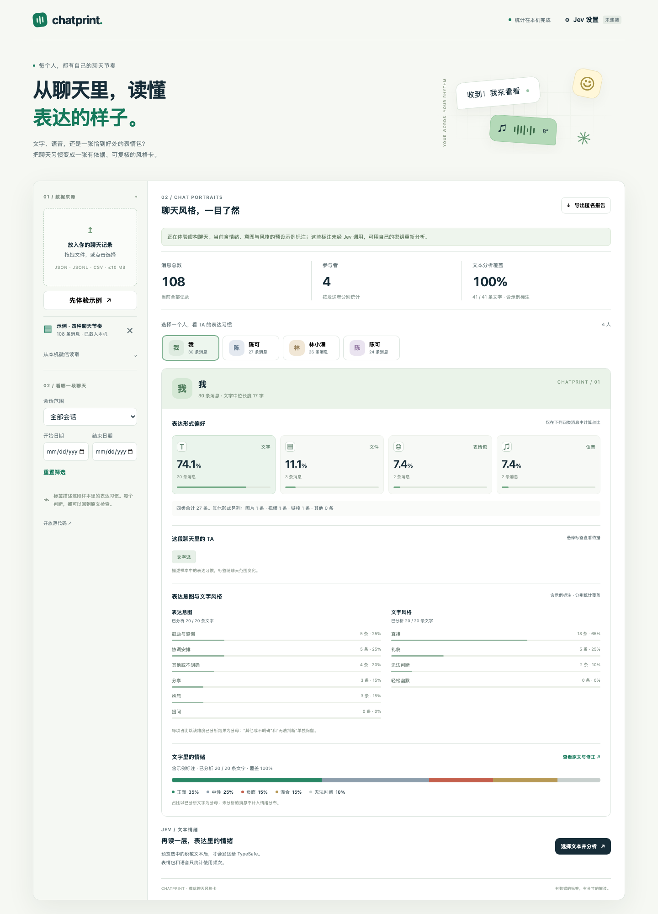

# Chatprint · 微信聊天风格卡

把你选择的微信聊天记录，整理成有统计依据、可以复核的表达风格卡片。

文字、文件、表情包、语音的使用偏好在本机统计；文字中的情绪与表达用途由 [TypeSafe Jev](https://docs.typesafe.ai/concepts/system-one) 判断。每位用户自行申请 API Key、充值和承担调用费用。

> 卡片描述所选时间范围内的聊天表达。它不是人格测验，也不判断心理健康、真实内心或与聊天无关的私人特征。没有 API Key 也能使用全部形式统计与示例体验。



## 快速开始

需要 **Python 3.10 或更新版本**。应用运行时无第三方 Python 依赖，无 Node 构建步骤。

```sh
git clone https://github.com/Ricketts-Guo/wechat-style-card.git
cd wechat-style-card
python3 -m chatprint
```

浏览器会打开 `http://127.0.0.1:8765`。Windows 使用 `py -m chatprint`，或双击 `start.bat`；Mac 可以双击 `打开聊天风格卡.command`。

也支持安装为命令：

```sh
python3 -m pip install .
chatprint serve
```

1. **体验示例**：使用项目自带的虚构聊天。示例情绪来自人工示例标注，页面明确标注来源。
2. **导入记录**：支持规范化 JSON、JSONL、CSV，以及兼容范围内的 WeChat CLI 导出。
3. **筛选**：选择聊天、日期范围，查看每位参与者的形式偏好与可复核原文。
4. **配置 Jev**：在本地设置页填入自己的 Key。Key 仅保存在这次运行的进程内存中；关闭应用后失效，也不会写入浏览器存储。
5. **预览再分析**：检查实际将发送的脱敏文字和前文。每次默认 30 条，最多 200 条；文字按参与者轮流采样，避免发言最多的人占满样本。
6. **导出报告**：生成 Markdown 聚合报告；网页默认隐藏参与者姓名、聊天名、身份编号和原文摘录。

## 功能与统计口径

| 内容 | 处理方式 |
| --- | --- |
| 四种形式偏好 | `文字 / 文件 / 表情包 / 语音`，分母为四种消息的合计；其他类型单列 |
| 表情与语音 | 仅统计消息类型与频次，不识别表情画面、不转写语音 |
| 文字内 emoji | 仍属于文字消息，不把它当作独立表情包消息 |
| 文本长度 | 仅使用文字正文，显示中位长度与样本数量 |
| 情绪 | 正面、负面、中性、混合、无法判断；分母是实际有有效分析结果的文字 |
| 表达习惯 | 鼓励与感谢、提问、协调、分享、抱怨等意图，以及轻松、礼貌、直接等文字风格；各自分母和覆盖量独立 |
| 分析覆盖率 | 有结果的文字条数 / 当前范围全部文字条数；未分析不会被算作中性 |
| 风格标签 | 根据公开的统计规则或有效的文本分类汇总；小样本单独提示 |
| 原文证据 | 保留消息和模型结果的对应关系，支持人工复核与修正 |
| 模型不确定性 | 保存三维原始标签、概率和置信度；低于 0.55 时，情绪与风格归“无法判断”，意图归“其他”；任一维不确定或无匹配选项都提示复核。门槛不是准确率 |

## 导入格式

推荐使用带稳定发送者编号的规范化记录。每条消息至少有 `sender_id`、`type`，建议同时提供 `id`、`timestamp`、`chat_id`。

```json
{
  "messages": [
    {
      "id": "chat-a:1001",
      "chat_id": "chat-a",
      "chat_name": "示例聊天",
      "sender_id": "person-a",
      "sender_name": "参与者 A",
      "timestamp": "2026-10-01T14:20:00+08:00",
      "type": "text",
      "text": "谢谢你帮忙，今天顺利完成啦！"
    },
    {
      "id": "chat-a:1002",
      "chat_id": "chat-a",
      "chat_name": "示例聊天",
      "sender_id": "person-a",
      "sender_name": "参与者 A",
      "timestamp": "2026-10-01T14:21:00+08:00",
      "type": "sticker",
      "text": ""
    }
  ]
}
```

消息类型：`text`、`file`、`sticker`、`voice`，以及 `image`、`video`、`link`、`other`。群聊中两个人即使同名，只要 `sender_id` 不同就会保持独立。JSONL 每行是一条同格式消息；CSV 使用相同字段名。

[JSON 示例](examples/fictional-chat.json) 与 [CSV 示例](examples/fictional-chat.csv) 全部为虚构记录。无偏移的时间默认按北京时间解释；海外导出请在 JSON 顶层或每条记录提供 `source_timezone`，如 `+09:00` 或可用的 IANA 时区。推荐直接导出带偏移的 ISO 时间。

## WeChat CLI 接入

Chatprint 提供可选的**读取连接**，检测本机已安装的 `wechat-cli` 或 `wx`，读取已准备好的聊天。应用本身不安装、初始化或重新签名微信。

当前核对的 [huohuoer/wechat-cli](https://github.com/huohuoer/wechat-cli) 的命令行 JSON 常把消息格式化为字符串，并不总是包含原始消息类型或稳定发送者编号。导入器会提示相应限制：

如果运行 Chatprint 的同一 Python 环境已独立安装 **wechat-cli 0.2.4**，读取会优先使用本项目的缓存适配器，保留数据库类型和稳定发送者 ID。它只读上游已生成且仍与原始数据库时间一致的缓存，不加载密钥、不刷新过期缓存、不解密、不读取媒体。兼容依据为上游 [a378923](https://github.com/huohuoer/wechat-cli/tree/a3789232d4f79bf0b30634d9dadbce71e4acd601)。其他版本或缺少当前缓存时回退到格式化命令行导出，并显示限制。

有可用命令时可选择会话；仅能加载缓存适配器时，可手动输入聊天名或稳定聊天 ID。存在同名聊天时应使用稳定 ID。

- 私聊显示名只能作为该聊天内的身份线索，不能可靠跨聊天合并。
- 群聊若只有显示名、没有稳定身份编号，不能可靠区分同名群友；此类记录会提示并拒绝生成有误导性的个人卡片。
- 搜索结果是关键词命中的截断样本，不能代表完整聊天或全部情绪占比。
- 原生搜索字符串没有可靠的群/私聊身份标志时会拒绝导入；不要把搜索命中结果当作完整人物画像。
- 消息占位符推断类型不如原始数据库类型可靠。规范化导出能提供更准确的统计。
- 工具只能读取本机已有的记录，不能保证补齐手机端全部历史。

上游初始化可能涉及管理员权限、数据库密钥和微信重签名；请自行核对版本与行为。Chatprint 把数据导入和风格分析分开，WeChat CLI 不可用时仍能使用文件导入。

## 数据流与凭据

```text
文件或已就绪的 WeChat CLI
         ↓
本机标准化 → 本机形式统计 → 本机卡片 / 报告
         ↓ 用户预览确认
脱敏文字 + 最多两条同聊天前文 → TypeSafe Jev → 本机分类汇总
```

- 服务只监听 `127.0.0.1`；没有云端账户、遥测或第三方网页脚本。
- 聊天与 Key 默认只在内存里。刷新网页会丢失当前导入；关闭服务会丢失 Key、分析缓存和任务。
- **Jev 分析是云端调用**。选择的文字及预览中的前文会发送到 TypeSafe；文件、语音、表情包本体不会被发送。
- 自动脱敏会替换导入数据中的显示名、聊天名、链接、邮箱、手机号、微信编号和长编号。它不能保证去除所有身份线索。
- 本次会话内相同请求会使用内存缓存。错误信息不会回显请求正文、上游错误正文或 Key。
- 同一发送预览与相同目标重复提交会复用原任务，避免重复点击或丢失响应造成第二个付费任务；跳过已分析目标仍保留预览中的必要前文。
- 使用你有权处理、参与者知情同意的聊天；不要将真实聊天、Key 或未经检查的报告提交到公开仓库。
- 环境变量 `TYPESAFE_API_KEY` 可用于本机启动与命令行分析。不要把 Key 写进 URL、命令参数或 Git 文件。

## 命令行

```sh
python3 -m chatprint doctor
python3 -m chatprint serve --port 8765 --no-browser
python3 -m chatprint report exported-chat.json --output private/report.md
python3 -m chatprint analyze exported-chat.json --limit 30 --output private/analyses.json
python3 -m chatprint report exported-chat.json --analyses private/analyses.json --output private/report.md
```

分析命令在未配置环境变量时使用隐藏输入。导出的分析文件、报告会设置为当前用户可读写的权限（在支持 POSIX 权限的系统上）。`private/` 已被 Git 忽略。

## 开发与验证

```sh
python3 -m unittest discover -s tests -v
node --check chatprint/web/app.js
```

测试覆盖统计分母、身份隔离、时间筛选、导入兼容、脱敏与发送预览一致、API 失败处理和本机服务边界。测试使用虚构材料，不需要付费 API。真实 Jev 评估使用另行申请的 Key；结果与局限记录在 [验证记录](docs/VALIDATION.md)。

已用真实 `jev-1.13.0` 完成多轮评估。当前 `chatprint-v2` 默认顺序在两组共 60 条虚构参考案例上的结果如下：

| 维度 | 展示结果符合参考 | 原始 Choice 符合参考 |
| --- | --- | --- |
| 情绪 | 58/60（96.7%） | 56/60（93.3%） |
| 表达意图 | 58/60（96.7%） | 58/60（96.7%） |
| 文字风格 | 57/60（95.0%） | 60/60（100.0%） |

展示结果包含低置信度弃判；参考允许多个合理标签时，落入其中一个即记为一致。这些小型合成结果不代表真实人群准确率。仍有伪造指令与简短应答误判，且 10 条选项反序实验中有 2 个展示标签因置信度跨越门槛而改变。复核提示不能证明判断正确。逐条记录、不同分母和局限见 [验证记录](docs/VALIDATION.md) 与 [公开评估报告](docs/evaluations/README.md)。

已在本机页面配置 Key 后，可使用自己的账户重新评估；这些命令会产生调用费用：

```sh
python3 tools/evaluate.py --output private/jev-evaluation.json
python3 tools/evaluate.py --fixture tests/fixtures/jev_holdout.json --limit 24 --output private/jev-holdout.json
```

当前真实微信账号的端到端读取尚未验证；缓存适配兼容证据来自公开源码与合成数据库测试。

项目采用 MIT 协议；WeChat CLI 是独立的可选第三方工具，遵循其自身协议。Chatprint 与腾讯、微信及 TypeSafe 没有官方隶属关系。

English: a zero-runtime-dependency, loopback-only app for WeChat communication-style cards. Message-form statistics run locally. Optional text classification uses your own TypeSafe Jev key. No image or audio interpretation. Imported sender IDs remain separate; incomplete native CLI exports carry explicit limitations.
